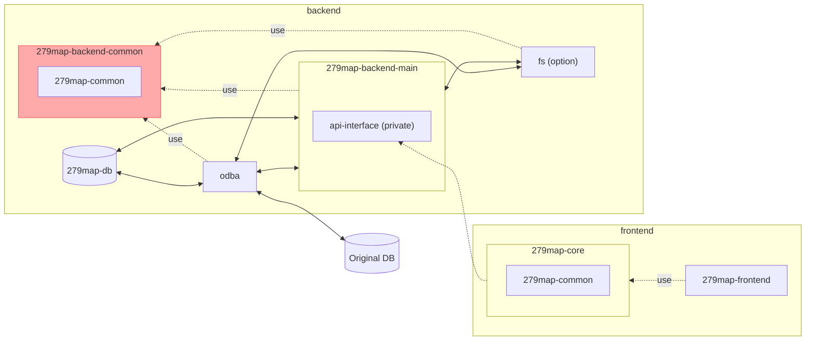

# 279map-backend-common
This is the common modules for backend.



## Deploy
1. update version.
	```shell
	npm version patch
	```
2. build
	```shell
	npm run rollup
	```
3. publish
	```shell
	npm publish ./
	```
