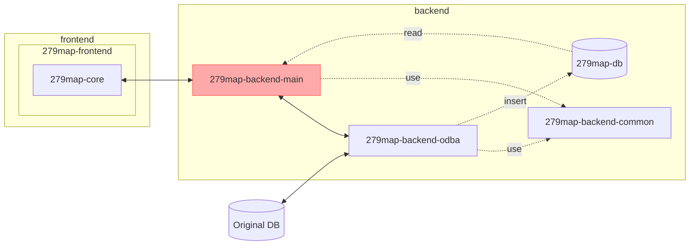

# 279map-backend-main
This is the main server of 279map.



## Develop
1. create .env.dev. from sample.
	```shell
	cp .env.dev.sample .env.dev
	```
2. edit .env.dev
3. package install
	```shell
	npm i
	```
4. start developer server.
	```shell
	npm run dev
	```
when you develop with running 279map-docker container, you stop 279map container.

## Deploy
### 279map-backend-main
1. make docker image
	```shell
	docker image build -t 279map-backend-main .
	```
