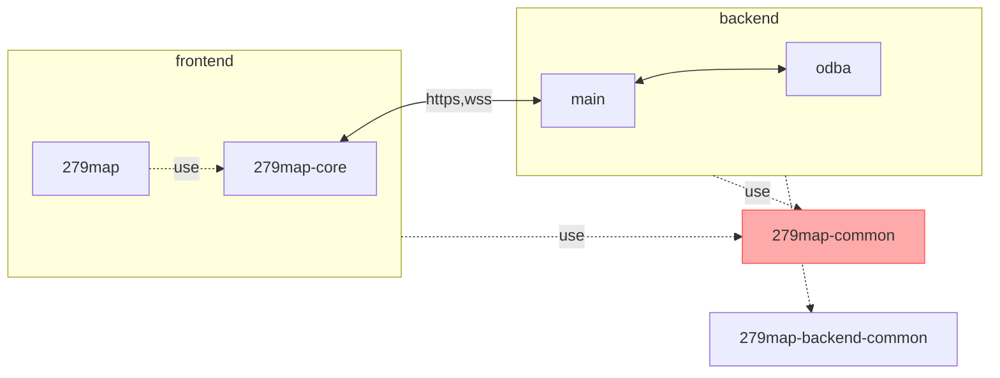

# 279map-common
This is used by 279map.
There are the modules which are used by both of frontend and backend.

279mapにて共通的に使用する資源を管理しています。


```mermaid
flowchart LR
	279map-common
	subgraph frontend
		279map-core
		279map -. use .-> 279map-core
	end
	subgraph backend
		direction TB
		main <--> odba
end
frontend -. use .-> 279map-common
backend -. use .-> 279map-common
backend -. use .-> 279map-backend-common
279map-core <-- https,wss --> main
style 279map-common fill:#faa, stroke:#f55
```

## Deploy
```
npm run rollup
```
