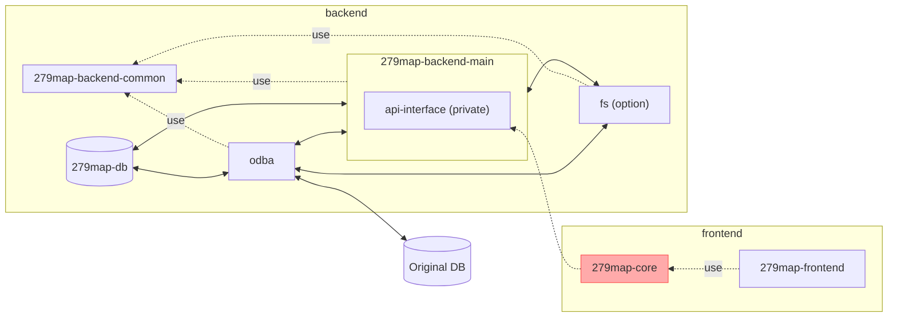

# 279map-core
This is used in 279map.
279map-core connects to 279map server and provides basic features of 279map.
if you want to make originai UI map, you can use 279map-core.



## How to use
if you want to make originai UI map, you can use 279map-core.

```javascript
// you need load jsts cdn
import 'https://unpkg.com/jsts@2.6.1/dist/jsts.min.js';

const props = {
    mapServerHost: 'localhost',
    mapId: 'test',
    iconDefine: [
        {
            id: 'pin',
            imagePath: '/icon/pin.png',
            useMaps: ['Real', 'Virtual'],
        },
        {
            id: 'school',
            imagePath: '/icon/house.png',
            useMaps: ['Virtual'],
        },
    ],
};

return (
	<TsunaguMap {...props}  />
)
```

→show [API References](documents/API.md)

## 279map compatiblity
|  279map-core  |  279map-main-backend  |
| ---- | ---- |
|  0.5.6  |  0.46.5  |
|  0.5.5 |  0.46.4  |


## Supplement
- if you use on Next.js, set  `swcMinify: false` in next.config.js.  279map use OpenLayers and it can't run when `swcMinify: true`.

## Copyright
Copyright (c) 2022 satocheeen.com

Released under the MPL-2.0 license

https://www.mozilla.org/en-US/MPL/2.0/
