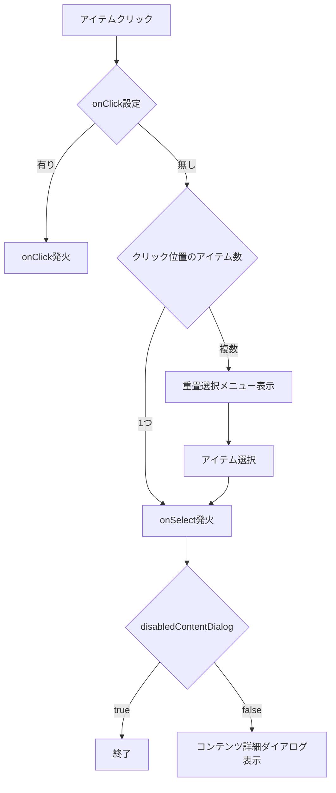

# APIリファレンス

## API
| Name | Type | 必須 | 説明 |
| ---- | ---- | ---- | ---- |
| mapId | string | * | 地図IDまたは地図Alias名を設定してください |
| mapServerHost | | * | |
| - host | string | * | 地図サーバー名を設定してください |
| - ssl | boolean | * | 地図サーバーにSSL通信で接続する場合はtrueを指定してください |
| - token | string | | Auth0等で認証を行う場合は、Auth0トークン等を渡してください |
| iconDefine | [IconDefine](#icondefine)[] |  | 地図で使用するアイコンを指定してください。未指定の場合は1種類のピンが使われます。 |
| popupMode | 'hidden' 'minimum' 'maximum' | | ポップアップの表示方式を指定してください。未指定時は'maximum'が設定されます。 |
| disabledLabel | boolean | | trueを指定すると、地図上のアイテムの名前が非表示になります |
| disabledContentDialog | boolean | | trueを指定すると、地図上でアイテムを選択しても詳細ダイアログは表示されません |
| overrideItems | OverrideItem[] | | 地図上に表示するアイテム情報を上書きします |
| onConnect | (param: [OnConnectParam](#onconnectparam)) => Promise<void\|[OnConnectResult](#onconnectresult)> | | 地図への接続が成功した際のコールバック |
| onMapLoad | (param: [OnMapLoadParam](#onmaploadparam)) => void | | 地図がロードされた際のコールバック |
| onSelect | (targets: DataId[]) => void | | 地図上のアイテムが選択された際のコールバック。選択解除された場合は、0個のtargetsを返す |
| onClick | (targets: DataId[]) => void | | 地図上のアイテムがクリックされた際のコールバック。 このコールバックが指定されている場合は、重畳アイテム選択メニューとonSelectコールバックは無効になります。|
| onModeChanged | (mode: MapMode) => void | | 地図表示モードが切り替わった際のコールバック |
| onCategoriesLoaded | (categories: CategoriDefine[]) => void | | カテゴリ情報がロードされた際のコールバック。カテゴリ情報に更新があった場合も発火されます。 |
| onEventsLoaded | (events: EventDefine[]) => void | | 日時情報がロードされた際のコールバック。日時情報に更新があった場合も発火されます |

地図上のアイテムをクリックした際のイベントの流れ

## Type
### IconDefine
| Name | Type | Description |
| ---- | ---- | ---- |
| id | string | 'default' | the icon id. when 'default', you can use default icon. |
| imagePath | string | the url of the icon. if 'default', you don't need set imagePath. |
| useMaps | ('Real' \| 'Virtual')[] | the map kinds using the icon |

### OnConnectParam
#### 接続成功時
| Name | Type | 説明 |
| ---- | ---- | ---- |
| result | 'success' | |
| mapDefine | [MapDefine](#mapdefine) | 接続先地図情報 |
| commandHook | [CommandHook](./Command_jp.md) | 地図に対して操作する際に使用するコントローラ |

### 接続失敗時
| Name | Type | 説明 |
| ---- | ---- | ---- |
| result | 'failure' | |
| error | {type: ErrorType; detail: string } | エラー内容 |

### OnConnectResult
OnConnectの復帰値として以下の任意値を返すことで、接続後の地図挙動を制御できる。
| Name | Type | 説明 |
| ---- | ---- | ---- |
| mapKind | MapKind | 任意項目。指定した種別の地図を初期ロードする。未指定時は地図に設定されたデフォルト種別が適用される。|

### MapDefine
| Name | Type | Description |
| ---- | ---- | ---- |
| mapId | string | map's id |
| name | string | map's name |
| useMaps | ('Real' \| 'Virtual')[] | the map kinds the map has |
| defaultMapKind | 'Real' \| 'Virtual' | if you don't set mapKind, the map kind is used |
| authLv | 'View' \| 'Edit' | the user's access level. |

### OnMapLoadParam
| Name | Type | Description |
| ---- | ---- | ---- |
| mapKind | MapKind | ロードされた地図種別 |
| dataSources | DataSource[] | 地図で使用されているデータソース一覧 |

