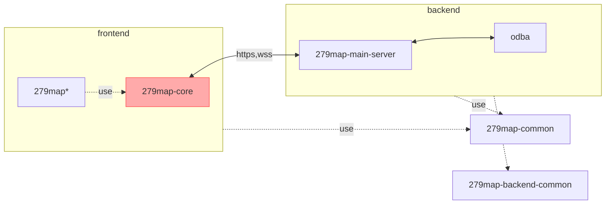

# 279map-core
This is used in 279map.
279map-core connects to 279map server and provides basic features of 279map.
if you want to make originai UI map, you can use 279map-core.

## Package Configuration

\* or original map you made

## Development
### build common package
1. build 279map-common
    ```shell
    cd 279map-common
    npm i
    npm run rollup
    ```
2. build 279map-backend-common
    ```shell
    cd 279map-backend-common
    npm i
    npm run rollup
    ```
### set up DB

3. package install in 279map-core
    ```shell
    cd 279map-core
    npm i
    ```

## Copyright
Copyright (c) 2022 satocheeen.com

Released under the MPL-2.0 license

https://www.mozilla.org/en-US/MPL/2.0/
