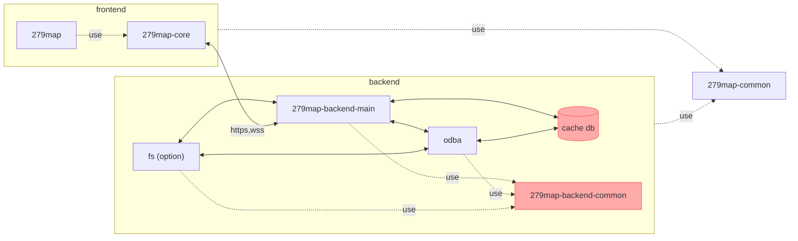

# 279map-backend-main
This is the main server of 279map.

## Package Configuration


## Deploy
### 279map-backend-common
1. update version in `package.json`.
2. execute `npm i` to update the version in `packege-lock.json`.
3. build
	```shell
	npm run rollup
	```
4. publish
	```shell
	npm publish ./
	```
### DB
1. make docker image
	```shell
	cd db
	docker image build -t 279map-db .
	```
