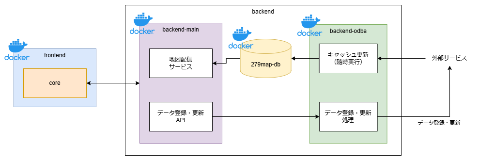

<div align="center">
	<h1>
		つなぐマップ<br/>
		<span style="font-size:60%">Tsunagu Map</span>
	</h1>
	<p>
	    
		
	    
		
	    
		
	</p>
	<p>
		
	</p>
	<p>
		<a href="https://279map-doc.satocheeen.com/">
			⇒システム紹介サイト
		</a>
	</p>
</div>

## Structure
### modules
つなぐマップは、以下のモジュールで構成されています。



| モジュール | 概要 | 実装言語・ライブラリ |
| ---- | ---- | ---- |
| core | フロントエンド側のコア機能 | React, TypeScript |
| backend-main | バックエンド側のコア機能 | Express, TypeScript |
| frontend | フロントエンドの画面 | React, TypeScript |
| backend-odba | 原本データアクセス | Express, TypeScript |
| db | 地図用キャッシュDB | MySQL |

本リポジトリでは、このうちのcore, backend-main, dbを管理しています。

### deployment
つなぐマップはDockerコンテナ上で動作します。
Dockerイメージは以下の単位で用意しています。
- frontend
- backend-main
- db
- backend-odba

frontendやbackend-odbaのイメージを差し替えることで、異なる画面に切り替えることや、別の外部サービスと連携させることが可能です。




## Develop
### set up Database
```shell
cd 279map-db
docker-compose up -d --build
```
#### build 279map-backend-main
1. create .env.dev. from sample.
    ```shell
    cd 279map-backend-main
    cp .env.dev.sample .env.dev
    ```
2. edit xxxxxx in .env.dev to your environment.
3. package install
    ```shell
    npm i
    cd 279map-backend-common
    npm i
    ```
#### build and start 279map-core
1. package install
    ```shell
    cd 279map-core
    npm i
    ```
### start development sesrver
1. start servers.
```shell
npm start
```
2. open https://localhost on your browser.

## Deploy
TODO: write

## Copyright
Copyright (c) 2022 satocheeen.com

Released under the MPL-2.0 license

https://www.mozilla.org/en-US/MPL/2.0/
