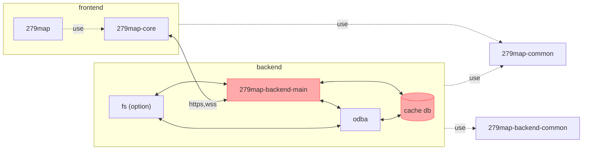

# 279map-backend-main
This is the main server of 279map.

## Package Configuration

```mermaid
flowchart LR
	279map-common
	subgraph frontend
		279map-core
		279map -. use .-> 279map-core
	end
	subgraph backend
		db[("cache db")]
		279map-backend-main <--> odba
		279map-backend-main <--> db
		odba <--> db
		fs["fs (option)"] <--> 279map-backend-main
		fs <--> odba
	end
	frontend -. use .-> 279map-common
	backend -. use .-> 279map-common
	backend -. use .-> 279map-backend-common
	279map-core <-- https,wss --> 279map-backend-main

    style 279map-backend-main fill:#faa, stroke:#f55
    style db fill:#faa, stroke:#f55
```

## Develop
```shell
npm i
npm run dev
```

## Deploy Dcoker Container
```shell
docker-compose up -d
```