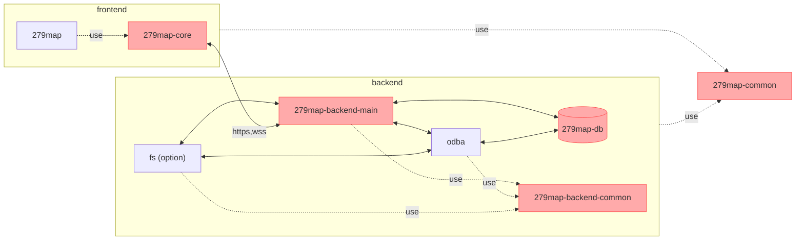

# 279map

## Package Configuration

\* or original map you made

| package | | detail |
|--|--|--|
| 279map-backend-main | main server |[ReadeMe](279map-backend-main/README.md) |
| 279map-core | frontend's core modules |[ReadeMe](279map-core/README.md) |
| 279map-common | common modules |[ReadeMe](279map-common/README.md) |
| 279map-backend-common | common modules for backend |[ReadeMe](279map-backend-common/README.md) |
| 279map-db | cache db | [ReadeMe](279map-db/README.md) |

## Develop
### set up Database
```shell
cd 279map-db
docker-compose up -d --build
```
### build common packages
1. build 279map-common
    ```shell
    cd 279map-common
    npm i
    npm run rollup
    ```
2. build 279map-backend-common
    ```shell
    cd 279map-backend-common
    npm i
    npm run rollup
    ```
#### build 279map-backend-main
1. create .env.dev. from sample.
    ```shell
    cd 279map-backend-main
    cp .env.dev.sample .env.dev
    ```
2. edit xxxxxx in .env.dev to your environment.
3. package install
    ```shell
    npm i
    ```
#### build and start 279map-core
1. package install
    ```shell
    cd 279map-core
    npm i
    ```
### start development sesrver
```shell
npm start
```

## Deploy
TODO: write

## Copyright
Copyright (c) 2022 satocheeen.com

Released under the MPL-2.0 license

https://www.mozilla.org/en-US/MPL/2.0/
